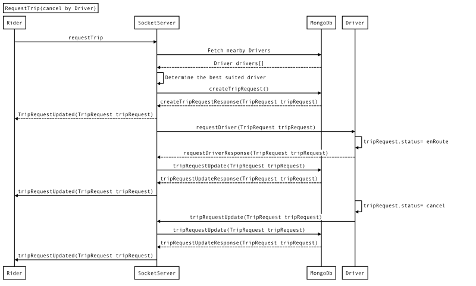
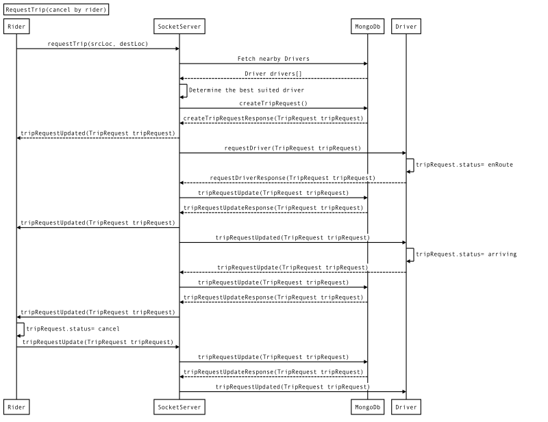

# Cancel Trip Request

* **Contents:**
* [Cancel Trip Request by Driver]()
* [Cancel Trip Request by Rider]()

#### Cancel Trip Request by Driver

Sequence Diagram for Driver cancelling the Trip Request

#### Cancel Trip Request by Rider

Sequence Diagram for Rider cancelling the Trip Request

