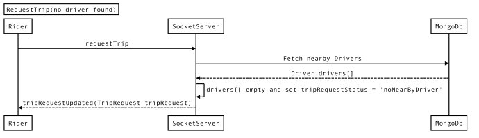

# Trip Request

* **Contents:**
* [Trip Request]()
* [Trip Request when no nearby Drivers found]()

#### Trip Request

Sequence Diagram for Trip Rquest

#### Trip Request when no nearby Drivers found

Sequence Diagram for Trip Request when no nearby Drivers found

